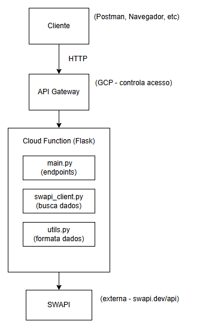

# Documentação de Arquitetura - Star Wars API

## Visão Geral

Este documento explica como a API foi estruturada e como ela funciona.

---

## Diagrama Simplificado

---

## Como Funciona

### 1. Cliente faz uma requisição

Exemplo: \GET /api/films?sort_by=title\

### 2. A requisição chega na API

- Flask recebe a requisição
- Valida os parâmetros
- Chama o cliente SWAPI

### 3. Cliente SWAPI busca os dados

- Verifica se tem no cache
- Se não tiver, busca na SWAPI
- Retorna os dados

### 4. Dados são processados

- \utils.py\ formata os dados
- Ordena conforme solicitado
- Adiciona informações extras (contagens)

### 5. Resposta é enviada

- JSON formatado
- Status HTTP correto
- Headers CORS configurados

---

## Componentes Principais

### main.py
Arquivo principal com todos os endpoints da API.

**O que faz:**
- Define as rotas (\/api/films\, \/api/people\, etc)
- Recebe os parâmetros da requisição
- Chama as funções necessárias
- Retorna a resposta em JSON

### swapi_client.py
Cliente que se conecta com a API do Star Wars.

**O que faz:**
- Faz requisições HTTP para SWAPI
- Implementa cache para não fazer requisições repetidas
- Trata erros de conexão
- Organiza os métodos por recurso (filmes, personagens, etc)

**Cache:**
Usei \@lru_cache\ para guardar em memória as últimas 128 requisições. Isso melhora muito a performance.

### utils.py
Funções auxiliares para processar dados.

**O que faz:**
- Formata os dados da SWAPI
- Extrai IDs das URLs
- Ordena resultados
- Remove informações desnecessárias

---

## Decisões Técnicas

### Por que Flask?
- Simples de usar
- Leve e rápido
- Boa documentação
- Funciona bem com Cloud Functions

### Por que cache?
- A SWAPI pode ser lenta às vezes
- Reduz chamadas desnecessárias
- Melhora a experiência do usuário

### Por que separar em módulos?
- Código mais organizado
- Mais fácil de testar
- Mais fácil de manter

---

## Preparação para GCP

O projeto foi pensado para rodar no Google Cloud Platform:

### Cloud Functions
- Cada requisição ativa uma instância
- Escala automaticamente
- Paga apenas pelo que usar

### Entry Point
A função \starwars_api(request)\ em \main.py\ é o ponto de entrada para o GCP.

### Configuração Sugerida
- Runtime: Python 3.14
- Memória: 256MB
- Timeout: 60s

---

## Testes

### Estratégia de Testes
- Testes unitários para funções isoladas
- Testes de integração para endpoints
- Mock da SWAPI para testes mais rápidos

### Cobertura
- 13 testes implementados
- Todos os endpoints cobertos
- Funções auxiliares testadas

---

## Considerações de Performance

### O que foi feito:
- Cache LRU implementado
- Session pooling do requests
- Timeout configurado

### Limitações:
- SWAPI às vezes é lenta (não temos controle)
- Cache é local (cada instância tem o seu próprio)

---

## Conclusão

O projeto atende os requisitos do case:
- Consome a SWAPI
- Endpoints funcionais
- Filtros e ordenação
- Pronto para GCP
- Testes implementados
- Código organizado

A arquitetura é simples mas eficiente, pensada para ser escalável no futuro.
